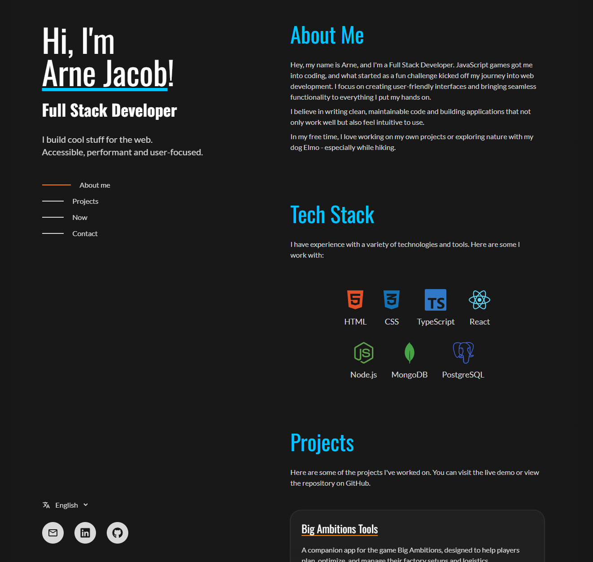

# Personal Portfolio

Personal portfolio website with a React frontend and an Express backend.

- Responsive portfolio UI
- GitHub activity integration
- Spotify now-playing integration
- Dockerized deployment
- Shared TypeScript setup

## Tech Stack

- Frontend: React, TypeScript, Vite, Tailwind CSS
- Backend: Express, TypeScript
- Tooling: npm workspaces, Docker Compose

## Live Demo

<https://dudeldups.dev>

## Preview



## Requirements

- Node.js 22+
- npm
- Docker (optional, for containerized runs)

## Environment Files

Create the following environment files:

- `frontend/.env`
- `backend/.env`

Use the provided `.env.example` files as templates.

## Local Development

Install dependencies from the project root:

```powershell
npm install
```

Start frontend and backend together:

```powershell
npm run dev
```

Default local URLs:

- Frontend: `http://localhost:5173`
- Backend: `http://localhost:4000`

## Docker

### Production-style Compose

Uses the single-container setup intended for the server:

```powershell
docker compose build
docker compose up -d
```

## Notes

- The frontend calls the backend through `/api/...`
- GitHub and Spotify responses are cached in the backend
- The backend serves the built frontend in production
